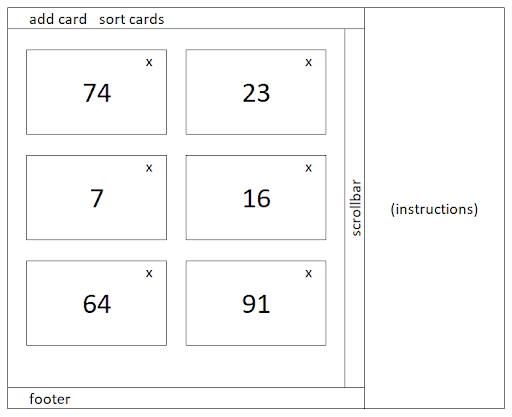

# Card-Application

- The app should have a  basic layout (Header, Instructions, Main, and Footer):
- The header should have these two buttons - Add Card and Sort Cards.
Add Card: it should add a new card with a randomly generated and unique number.
- Sort Cards: it should sort all of the cards by their numbers, from lowest to highest.
- When the application is starting, the card container must be empty. The user should select Add Card in order to add the cards in the container.
- All of the cards must have an X icon on the top of the right side. This icon’s function is to delete the card.
- In the component, where the cards are added, a scrollbar should appear when the quantity of cards is more than the height of the page. However, you don’t need to have the scrollbar at the beginning or when the amount of cards is smaller or equal to the height of the container. It's visible in the image only so users will see cards can be infinite.
- On the right side of the page, we should have a component. There should be written Instructions.
- On the bottom, we should have a basic footer.

- 
